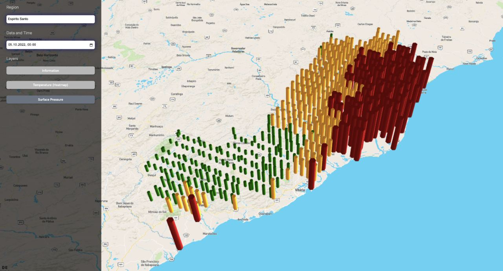

# Weather Visualization Project

## Overview

This project is a robust tool for visualizing complex weather data. It provides an intuitive interface that allows users to interact with and analyze weather conditions in various regions, offering insights through different visualization layers like heatmaps, scatterplots, and surface pressure representations.

## Main Technologies Used

- **React**
- **Deck.gl**
- **Azure Blob Storage**
- **Turf.js**
- **Papa Parse**

## Features

- **Interactive Map**: Visualize complex weather data interactively on a map interface.
- **Data Filtering**: Users can filter weather data based on the selected region and date-time.
- **Visualization Layers**: Toggle between different visualization layers including:
  - **Heatmaps**
  - **Scatterplots**
  - **Surface Pressure**

## Installation & Setup

### Prerequisites

Ensure you have the following installed on your system:

- **Node.js**
- **npm** (comes bundled with Node.js)
- An **Azure Blob storage account** with relevant credentials

### Installation Steps

1. **Clone the Repository**

```bash
git clone [repository-url]
cd <project name>
```

2. **Install Dependencies**

```bash
npm install
```
3. **Environment Variables**

Create a .env file in the root directory and populate it with your Azure Blob Storage credentials.

```bush
NEXT_PUBLIC_AZURE_CONNECTION_STRING=your-azure-connection-string
NEXT_PUBLIC_CONTAINER_NAME=your-container-name
NEXT_PUBLIC_BLOB_NAME_WEATHER=your-blob-name-for-weather-data
```
*Replace the placeholders with your actual credentials.*

4. **Start the Application
```bush
npm start
```

Before running the project, ensure you have uploaded the necessary data tables to your Azure Blob Storage. If your data structure differs or has been updated, you might need to make corresponding changes in the API files located in the `api` folder to ensure correct data retrieval and processing.

The application will be running on http://localhost:3000.




